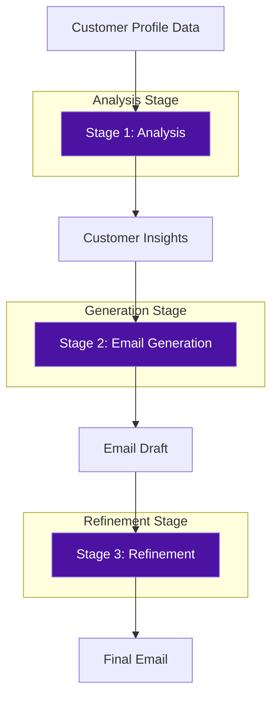
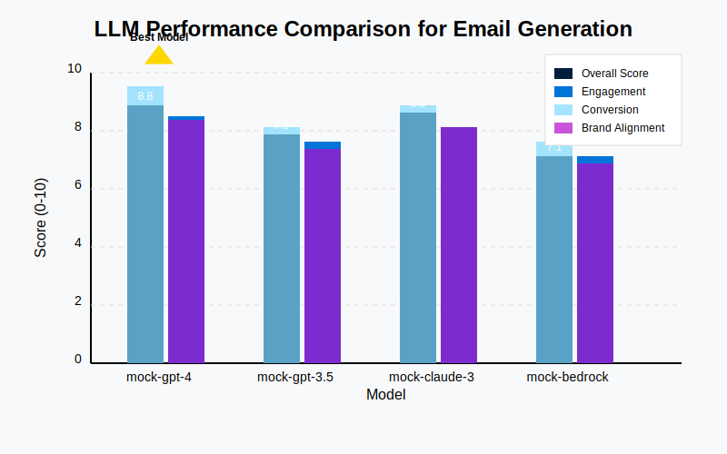
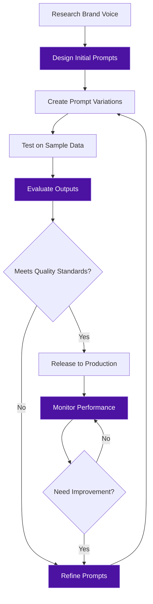

# Octopus Energy Marketing Email Assistant

## Project Overview

A demonstration project showcasing a prompt engineering approach for creating personalized marketing emails using LangChain and LLMs. (All the data and figures are dummy figures, only for the same of representation)



## Project Goals

This project demonstrates my approach to prompt engineering for generating marketing emails at Octopus Energy. It specifically addresses:

1. **Orchestration Workflow**: How I designed a multi-stage process for email generation
2. **Model Evaluation**: How I systematically assessed LLMs for this task
3. **Prompt Curation**: How I crafted and iterated on prompts to achieve optimal results

## Orchestration Workflow

I designed a three-stage workflow to break down the complex email generation task:

1. **Analysis Stage**: The LLM analyzes customer data (usage patterns, location, tariff) to generate personalized insights
2. **Generation Stage**: Using these insights, it creates a personalized email draft
3. **Refinement Stage**: The draft is optimized for clarity, engagement, and conversion potential

```python
def generate_campaign(customer_profile):
    # Stage 1: Analyze customer data
    customer_insights = analysis_chain.invoke({
        "customer_name": customer_profile.name,
        "tariff_type": customer_profile.tariff_type,
        "energy_usage": customer_profile.energy_usage,
        "location": customer_profile.location,
        "peak_usage_time": customer_profile.peak_usage_time,
        "customer_history": customer_profile.history_summary
    })
    
    # Stage 2: Generate email draft
    email_draft = generation_chain.invoke({
        **customer_profile.dict(),
        "customer_insights": customer_insights["customer_insights"]
    })
    
    # Stage 3: Refine and optimize email
    final_email = refinement_chain.invoke({
        "email_draft": email_draft["email_draft"],
        "customer_name": customer_profile.name,
        "tariff_type": customer_profile.tariff_type
    })
    
    return EmailCampaign(
        customer_id=customer_profile.customer_id,
        email_subject=extract_subject(final_email["final_email"]),
        email_body=final_email["final_email"],
        customer_insights=customer_insights["customer_insights"],
        draft_version=email_draft["email_draft"],
        final_version=final_email["final_email"]
    )
```

This modular approach provides several advantages:
- Each stage can be optimized independently
- The system can trace and evaluate performance at each step
- Complex reasoning is broken into manageable chunks for the LLM

## Model Evaluation Framework

I developed a comprehensive evaluation framework to assess LLM performance: 
(All the data and figures are dummy figures, only for the same of representation)



### Model Performance Summary

| Model | Overall Score | Engagement | Conversion | Brand Alignment |
|-------|--------------|------------|------------|-----------------|
| mock-gpt-4 | 8.8 | 8.5 | 9.2 | 8.5 |
| mock-gpt-3.5 | 7.9 | 8.0 | 8.2 | 7.6 |
| mock-claude-3 | 8.6 | 8.3 | 8.9 | 8.5 |
| mock-bedrock | 7.1 | 7.2 | 7.8 | 6.9 |

The evaluation system assesses email outputs along four key dimensions:
- **Content Quality**: Clarity, conciseness, grammar, persuasiveness, readability
- **Brand Alignment**: Tone, language clarity, brand personality, distinctiveness
- **Personalization**: Name usage, tariff relevance, specific needs, tailored benefits
- **CTA Effectiveness**: Clarity, prominence, persuasiveness, urgency, value proposition

These dimensions are combined into aggregate metrics:
- **Engagement Score**: How likely the email is to be read and engaged with
- **Conversion Potential**: How effectively it drives action
- **Brand Alignment Score**: How well it matches Octopus Energy's voice
- **Overall Score**: Weighted combination of all metrics

```python
def calculate_overall_score(evaluation_results):
    """Calculate an overall quality score based on multiple dimensions"""
    engagement_score = evaluation_results.get("engagement_score", 5.0)
    conversion_potential = evaluation_results.get("conversion_potential", 5.0)
    brand_alignment_score = evaluation_results.get("brand_alignment_score", 5.0)
    
    # Weighted score calculation
    overall_score = (
        engagement_score * 0.3 +
        conversion_potential * 0.4 +
        brand_alignment_score * 0.3
    )
    
    return round(overall_score, 1)
```

## Prompt Curation Methodology

My prompt development process followed a systematic approach:



### 1. System Prompts as Foundation
I started with carefully crafted system prompts that:
- Define the AI's role as an expert email marketing assistant
- Establish Octopus Energy's brand voice and constraints
- Set quality expectations

```
You are an Expert Email Marketing Assistant for Octopus Energy, specializing in personalized
energy marketing campaigns. You have years of experience in crafting engaging, persuasive
energy-focused emails that drive conversions while maintaining Octopus Energy's friendly,
customer-centric brand voice.
```

### 2. Structured Prompt Templates
Each task has a dedicated prompt template with:
- Clear task definition
- Specific input format
- Step-by-step process guidelines
- Concrete output requirements
- Constraints and quality standards

Here's an example of my structured prompt for the analysis stage:

```
## TASK: ANALYZE CUSTOMER DATA FOR EMAIL PERSONALIZATION

You'll be provided with customer data for an Octopus Energy user. Analyze this data to identify 
key insights that would help personalize a marketing email.

### CUSTOMER INFORMATION:
- Name: {customer_name}
- Current Tariff: {tariff_type}
- Monthly Energy Usage: {energy_usage} kWh
- Location: {location}
- Peak Usage Time: {peak_usage_time}
- Customer History: {customer_history}

### ANALYSIS INSTRUCTIONS:
1. Identify usage patterns that might indicate potential savings opportunities
2. Determine which Octopus Energy plans might best suit this customer
3. Consider seasonal factors based on location and time of year
4. Analyze peak usage times to identify potential smart-meter benefits
5. Review customer history to personalize messaging (long-time customer vs. new user)

### OUTPUT GUIDELINES:
- Provide 3-5 key insights about this customer
- Suggest specific messaging angles that would resonate with this customer
- Recommend specific features to highlight based on their usage patterns
- Identify any potential pain points this customer might have with their current plan
- Suggest tone and approach based on their profile (e.g., data-driven, cost-conscious, eco-minded)

Your analysis should be structured, evidence-based, and focused on actionable insights for email personalization.
```

### 3. Prompt Versioning
I implemented multiple versions of each prompt to enable systematic testing:

**Analysis Prompt Evolution:**
```
# Version 1 (Basic)
Analyze the following customer data and provide insights for email personalization:
Customer: {customer_name}
Tariff: {tariff_type}
Usage: {energy_usage} kWh
Location: {location}

Provide 3 key insights about this customer's energy usage patterns.

# Version 3 (Advanced)
## CUSTOMER ANALYSIS TASK

Thoroughly analyze this Octopus Energy customer:
* Customer: {customer_name}
* Current Plan: {tariff_type}
* Monthly Usage: {energy_usage} kWh
* Location: {location}
* Usage Peak: {peak_usage_time}
* History: {customer_history}

First, identify usage patterns.
Second, compare to similar customers.
Third, calculate potential savings opportunities.
Finally, recommend specific messaging angles.

Your analysis should be data-driven and actionable.
```

### 4. A/B Testing Framework
The implementation includes frameworks for testing variations in:
- **Subject Line Styles**: Savings-focused, question-based, eco-focused, etc.
- **CTA Variations**: Action-oriented, benefit-focused, low-commitment, etc.
- **Structure**: Various email formats and content organization

```python
# A/B testing variants for email subject lines
SUBJECT_LINE_VARIANTS = {
    "savings_focused": "{customer_name}, Save {potential_savings}% on Your Energy Bills This Month",
    "question_based": "Are You Overpaying for Energy, {customer_name}?",
    "eco_focused": "Power Your Home with 100% Green Energy & Save {potential_savings}%",
    "urgency_based": "Last Chance: Switch & Save {potential_savings}% Before Prices Change",
    "benefit_focused": "More Control, Lower Bills: A Special Offer for {customer_name}"
}
```

## Project Structure

```
octopus-email-assistant/
├── orchestration/
│   ├── workflow.py      # Multi-stage email generation workflow
│   ├── chains.py        # LangChain components for each stage
│   └── agent.py         # Marketing assistant agent
├── prompts/
│   ├── system_prompts.py    # Foundational role definitions
│   ├── email_templates.py   # Main prompt templates
│   └── base_templates.py    # Versioned template variations
├── evaluation/
│   ├── evaluators.py    # LLM output evaluation framework
│   ├── metrics.py       # Scoring functions
│   └── test_cases.py    # Systematic model testing
├── static/
│   └── model_comparison.svg # Model performance visualization
└── schemas/
    └── customer.py      # Data validation schemas
```

## Sample Output

**Customer Insights:**
```
Based on the customer data analysis, here are the key insights:

1. This customer has higher than average energy usage during evening hours (7pm-11pm),
   suggesting they might benefit from an Economy 7 tariff or time-of-use optimization.

2. Their location in London indicates they're in an area with high adoption of smart
   home technology and environmental consciousness.

3. Their current Standard Variable tariff is not optimized for their usage patterns,
   which show consistency month-to-month.

4. Given their energy consumption and current tariff, there's potential for 12-15%
   savings by switching to the GreenFlex plan.

5. Customer history shows interest in renewable energy options but concern about
   initial costs - messaging should emphasize immediate savings alongside
   environmental benefits.
```

**Generated Email:**
```
Subject: Alex, Cut Your Evening Energy Costs by 15% This Month

Hi Alex,

Looking at your recent energy usage, I noticed you're using most power during
evenings on your Standard Variable tariff. This presents a perfect opportunity!

Switch to our GreenFlex plan and save 15% on your monthly bills – that's around
£180 over the next year based on your 350 kWh monthly usage. Plus, you'll be
powering your home with 100% renewable electricity.

Perfect for your lifestyle:
• Lower rates during your actual usage hours
• Real-time consumption tracking in our simple app
• 100% green energy without the premium price
• No contract lock-in – flexibility guaranteed

Take 2 minutes to switch now and start saving immediately.

[See Your Exact Savings]

The Octopus Energy Team
```

## Key Advantages

This implementation demonstrates several strengths relevant to a prompt engineering role:

1. **Systematic Methodology**: A structured approach to prompt development rather than ad-hoc solutions
2. **Evaluation Framework**: Comprehensive metrics for measuring prompt effectiveness
3. **Prompt Versioning**: Clear system for tracking prompt iterations and improvements
4. **Brand Voice Integration**: Techniques for ensuring AI outputs match specific brand guidelines
5. **LangChain Expertise**: Leveraging LangChain for complex multi-stage workflows

## Core Code: Orchestration Workflow

```python
# orchestration/workflow.py

from langchain.chains import LLMChain, SequentialChain
from langchain.memory import ConversationBufferMemory
from langchain_core.tracers import LangChainTracer
from langchain.prompts import PromptTemplate
import langsmith
from langchain_openai import ChatOpenAI
from langchain_anthropic import ChatAnthropic
from langchain_community.chat_models import BedrockChat

from config.settings import LANGSMITH_API_KEY, OPENAI_API_KEY, ANTHROPIC_API_KEY, AWS_REGION
from prompts.email_templates import (
    EMAIL_ANALYSIS_TEMPLATE,
    EMAIL_GENERATION_TEMPLATE,
    EMAIL_REFINEMENT_TEMPLATE
)
from schemas.customer import CustomerProfile
from schemas.email import EmailCampaign
from utils.logger import get_logger

logger = get_logger(__name__)

class EmailCampaignWorkflow:
    """
    Orchestrates the entire email campaign generation workflow using LangChain.
    The workflow consists of three main stages:
    1. Customer Data Analysis
    2. Email Draft Generation
    3. Email Refinement and Optimization
    """
    
    def __init__(self, model_name="gpt-4", trace_name="octopus-email-campaign"):
        self.trace_name = trace_name
        self.model_name = model_name
        self.tracer = LangChainTracer(project_name=trace_name)
        
        # Initialize the appropriate LLM based on model_name
        self.llm = self._initialize_llm(model_name)
        
        # Set up conversation memory
        self.memory = ConversationBufferMemory(return_messages=True)
        
        # Build the individual chains
        self.analysis_chain = self._build_analysis_chain()
        self.generation_chain = self._build_generation_chain()
        self.refinement_chain = self._build_refinement_chain()
        
        # Build the sequential workflow
        self.workflow = self._build_workflow()
    
    def _initialize_llm(self, model_name):
        """Initialize the appropriate LLM based on model name"""
        if model_name.startswith("gpt"):
            return ChatOpenAI(
                model_name=model_name,
                temperature=0.7,
                openai_api_key=OPENAI_API_KEY
            )
        elif model_name.startswith("claude"):
            return ChatAnthropic(
                model=model_name,
                temperature=0.7,
                anthropic_api_key=ANTHROPIC_API_KEY
            )
        elif model_name.startswith("bedrock"):
            # For AWS Bedrock models
            model_id = model_name.split("-", 1)[1]  # Extract model ID after "bedrock-"
            return BedrockChat(
                model_id=model_id,
                region_name=AWS_REGION,
                model_kwargs={"temperature": 0.7}
            )
        else:
            raise ValueError(f"Unsupported model: {model_name}")
    
    def _build_analysis_chain(self):
        """Build the customer data analysis chain"""
        analysis_prompt = PromptTemplate(
            template=EMAIL_ANALYSIS_TEMPLATE,
            input_variables=["customer_name", "tariff_type", "energy_usage", 
                            "location", "peak_usage_time", "customer_history"]
        )
        
        return LLMChain(
            llm=self.llm,
            prompt=analysis_prompt,
            output_key="customer_insights",
            verbose=True
        )
    
    def _build_generation_chain(self):
        """Build the email generation chain"""
        generation_prompt = PromptTemplate(
            template=EMAIL_GENERATION_TEMPLATE,
            input_variables=["customer_name", "tariff_type", "energy_usage", 
                           "potential_savings", "recommended_plan", 
                           "location", "peak_usage_time", "customer_insights"]
        )
        
        return LLMChain(
            llm=self.llm,
            prompt=generation_prompt,
            output_key="email_draft",
            verbose=True
        )
    
    def _build_refinement_chain(self):
        """Build the email refinement and optimization chain"""
        refinement_prompt = PromptTemplate(
            template=EMAIL_REFINEMENT_TEMPLATE,
            input_variables=["email_draft", "customer_name", "tariff_type"]
        )
        
        return LLMChain(
            llm=self.llm,
            prompt=refinement_prompt,
            output_key="final_email",
            verbose=True
        )
    
    def _build_workflow(self):
        """Build the complete sequential workflow"""
        return SequentialChain(
            chains=[self.analysis_chain, self.generation_chain, self.refinement_chain],
            input_variables=["customer_name", "tariff_type", "energy_usage", 
                           "potential_savings", "recommended_plan", 
                           "location", "peak_usage_time", "customer_history"],
            output_variables=["customer_insights", "email_draft", "final_email"],
            verbose=True
        )
    
    def generate_campaign(self, customer_profile: CustomerProfile) -> EmailCampaign:
        """
        Generate an email campaign for a specific customer
        
        Args:
            customer_profile: Customer data including usage patterns
            
        Returns:
            EmailCampaign object containing the generated campaign
        """
        try:
            # Start tracing with LangSmith
            with langsmith.trace(
                project_name=self.trace_name,
                tags=["production", f"model:{self.model_name}"]
            ):
                # Prepare inputs
                inputs = {
                    "customer_name": customer_profile.name,
                    "tariff_type": customer_profile.tariff_type,
                    "energy_usage": customer_profile.energy_usage,
                    "potential_savings": customer_profile.potential_savings,
                    "recommended_plan": customer_profile.recommended_plan,
                    "location": customer_profile.location,
                    "peak_usage_time": customer_profile.peak_usage_time,
                    "customer_history": customer_profile.history_summary
                }
                
                # Execute the workflow
                logger.info(f"Generating campaign for customer: {customer_profile.name}")
                results = self.workflow.invoke(inputs)
                
                # Create EmailCampaign object
                campaign = EmailCampaign(
                    customer_id=customer_profile.customer_id,
                    email_subject=self._extract_subject(results["final_email"]),
                    email_body=results["final_email"],
                    customer_insights=results["customer_insights"],
                    draft_version=results["email_draft"],
                    final_version=results["final_email"],
                    model_used=self.model_name
                )
                
                return campaign
                
        except Exception as e:
            logger.error(f"Error generating campaign: {str(e)}")
            raise
    
    def _extract_subject(self, email_text):
        """Extract the subject line from the generated email"""
        if "Subject:" in email_text:
            return email_text.split("Subject:")[1].split("\n")[0].strip()
        return "Special Offer from Octopus Energy"  # Default subject
```

This project showcases my approach to prompt engineering as a systematic discipline requiring careful design, testing, evaluation, and refinement.
